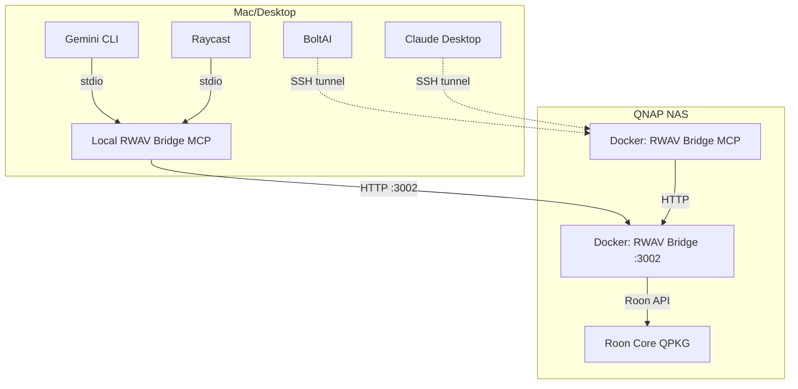
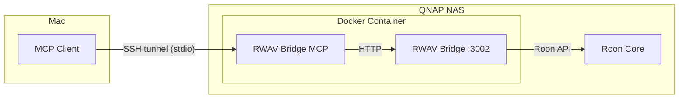
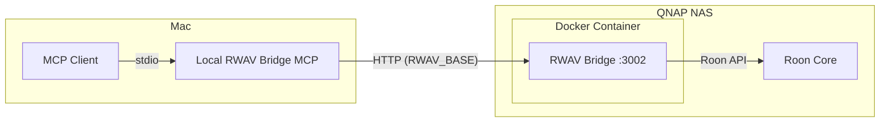

# Architecture

## Overview

This project provides a single Docker container that hosts both **RWAV Bridge** (Roon extension) and **RWAV Bridge MCP** server, enabling AI-powered control of Roon from MCP clients.

## Component Diagram



## Components

### Roon Core (QPKG)
- Official Roon Server running on QNAP TVS-951X
- Manages audio zones, library, and playback
- Discovered automatically by RWAV Bridge via network broadcast

### RWAV Bridge
- Roon extension that exposes HTTP REST API on port 3002
- Discovers and connects to Roon Core on the LAN
- Provides endpoints for playback control, browsing, queue management

### RWAV Bridge MCP
- Node.js MCP server using stdio transport
- Translates MCP tool calls to RWAV Bridge HTTP requests
- Provides typed, safe tools for AI assistants

### MCP Clients
- **BoltAI**, **Claude Desktop**, **Gemini CLI**
- Connect via stdio to MCP server running in container
- Issue natural language commands translated to Roon actions

## Network Flow (Remote Deployment)

```
┌─────────────────────────────────────────────────────────────────────────────┐
│                              QNAP NAS                                       │
│  ┌───────────────────────────────────────────────────────────────────────┐  │
│  │                    Docker Container (roon-mcp)                        │  │
│  │                                                                       │  │
│  │   ┌─────────────────────┐         ┌─────────────────────┐            │  │
│  │   │  RWAV Bridge MCP    │◄───────►│   RWAV Bridge       │            │  │
│  │   │  (stdio)            │  HTTP   │   :3002             │            │  │
│  │   └─────────────────────┘         └──────────┬──────────┘            │  │
│  │                                              │                        │  │
│  └──────────────────────────────────────────────┼────────────────────────┘  │
│                                                 │ Roon API                  │
│                         ┌───────────────────────▼────────────────────────┐  │
│                         │          Roon Core (QPKG)                      │  │
│                         │          UDP 9003 (discovery)                  │  │
│                         └────────────────────────────────────────────────┘  │
└─────────────────────────────────────────────────────────────────────────────┘
                                      ▲
                                      │ SSH tunnel / HTTP :3002
                                      │
┌─────────────────────────────────────┴───────────────────────────────────────┐
│                              Mac (Desktop)                                  │
│   ┌──────────────┐  ┌──────────────┐  ┌──────────────┐  ┌──────────────┐   │
│   │   BoltAI     │  │Claude Desktop│  │  Gemini CLI  │  │   Raycast    │   │
│   └──────────────┘  └──────────────┘  └──────────────┘  └──────────────┘   │
│                                                                             │
│   Connection options:                                                       │
│   • SSH tunnel → docker exec → rwav-bridge-mcp (stdio over SSH)            │
│   • Local rwav-bridge-mcp → HTTP to QNAP:3002 (recommended)                │
└─────────────────────────────────────────────────────────────────────────────┘
```

## Container Internals

| Process | Port | Function |
|---------|------|----------|
| RWAV Bridge | 3002 | HTTP API for Roon control |
| RWAV Bridge MCP | stdio | MCP server for AI clients |

### Startup Sequence

1. `entrypoint.sh` starts RWAV Bridge (`/opt/rwav-bridge/run.sh`)
2. Health check waits for port 3002 to respond
3. RWAV Bridge MCP starts with `RWAV_BASE=http://127.0.0.1:3002`
4. Container listens on stdio for MCP connections

### Shutdown

- Traps `SIGTERM`/`SIGINT`
- Gracefully stops MCP server first, then RWAV Bridge

---

## Remote Connection Options

When Docker runs on QNAP and MCP clients run on your Mac, there are two connection patterns:

### Option 1: SSH Tunnel



**How it works:**
- MCP client spawns SSH process
- SSH connects to QNAP and runs `docker exec -i roon-mcp rwav-bridge-mcp`
- Stdio is tunneled over SSH

### Option 2: Local MCP + Remote Bridge (Recommended)



**How it works:**
- RWAV Bridge MCP installed locally via Homebrew
- MCP server connects directly to RWAV Bridge HTTP API on QNAP
- Lower latency, no SSH dependency

### Comparison

| Aspect | SSH Tunnel | Local MCP |
|--------|------------|-----------|
| Setup complexity | Higher (SSH keys) | Lower (Homebrew) |
| Latency | Higher | Lower |
| Dependencies | SSH access to QNAP | Local npm/brew install |
| Docker requirement | Full container | Only RWAV Bridge |
