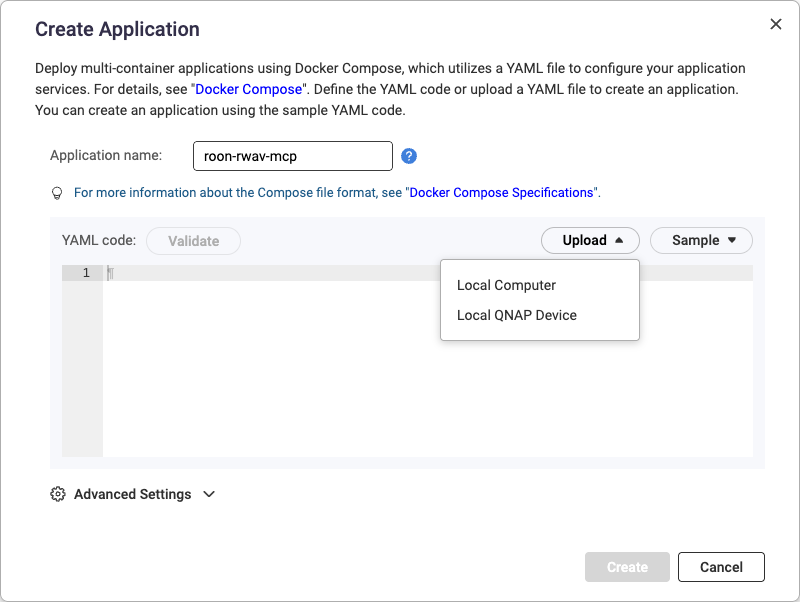
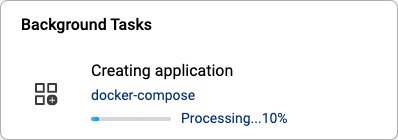

# roon-mcp-qnap

Docker container for **[RWAV Bridge](https://rwav-bridge.co.uk/)** + **[RWAV Bridge MCP](https://rwav-bridge.co.uk/)** server, designed for deployment on QNAP NAS with Roon Server QPKG.

Control Roon via MCP from **BoltAI**, **Claude Desktop**, and **Gemini CLI**.

## Prerequisites

- **Roon Core**: Running on QNAP (Roon Server QPKG) or elsewhere on your network
- **Docker**: Available on QNAP (Container Station) or local machine
- **Network**: Container must reach Roon Core for discovery

## Quick Start

### Build

```bash
# Clone repository
git clone https://github.com/your-username/roon-mcp-qnap.git
cd roon-mcp-qnap

# Build image
docker build -f Dockerfile.roon-mcp -t roon-mcp-qnap:latest .
```

### Run

```bash
# Run with host network (recommended for Roon discovery)
docker run -d --network host --name roon-mcp roon-mcp-qnap:latest

# Check logs
docker logs -f roon-mcp
```

### Using Docker Compose

```bash
docker compose up -d
docker compose logs -f
```

## Deployment on QNAP

📖 **[QNAP Container Station Documentation](https://www.qnap.com/en/how-to/tutorial/article/how-to-use-container-station-2)**

### Option 1: Via Container Station UI (Recommended)

1. Open **Container Station** on your QNAP (https://your-nas/container-station/)
2. Go to **Applications** → **Create**
3. Select **Create Application**
4. Upload or paste `docker-compose.yml`:
   - Click **Upload** → **Local QNAP Device** → select `/share/CACHEDEV1_DATA/Container/roon-mcp-qnap/docker-compose.yml`
   - Or paste the contents of [`docker-compose.yml`](./docker-compose.yml) directly
   
   
5. **Important**: First copy `Dockerfile.roon-mcp` and `entrypoint.sh` to `/share/CACHEDEV1_DATA/Container/roon-mcp-qnap/` on your QNAP
6. Expand **Advanced Settings** → **Default Web URL Port** (optional):
   - **Service**: `roon-mcp`
   - **Default web URL port**: `3002`
7. Click **Create** and wait for the container to build (this takes a few minutes)

   

8. Check logs in Container Station to verify RWAV Bridge connects to Roon Core

### Option 2: Push to Registry

```bash
# Tag and push (from Mac)
docker tag roon-mcp-qnap:latest your-registry/roon-mcp-qnap:latest
docker push your-registry/roon-mcp-qnap:latest

# On QNAP Container Station: pull the image and create container
```

### Option 3: Build on QNAP via SSH

```bash
# Copy files to QNAP
scp Dockerfile.roon-mcp entrypoint.sh user@nas:/share/Container/roon-mcp-qnap/

# SSH to QNAP and build (requires admin privileges)
ssh admin@nas
cd /share/Container/roon-mcp-qnap
docker build -f Dockerfile.roon-mcp -t roon-mcp-qnap:latest .
docker run -d --network host --name roon-mcp roon-mcp-qnap:latest
```

## Environment Variables

| Variable | Default | Description |
|----------|---------|-------------|
| `RWAV_BASE` | `http://127.0.0.1:3002` | RWAV Bridge URL (internal) |
| `HEALTH_CHECK_TIMEOUT` | `60` | Startup timeout in seconds |
| `MCP_MODE` | `stdio` | MCP transport mode |

## Version Pinning

```bash
docker build -f Dockerfile.roon-mcp \
  --build-arg RWAV_BRIDGE_VERSION=1.1.6 \
  --build-arg RWAV_MCP_VERSION=1.0.0 \
  -t roon-mcp-qnap:pinned .
```

## MCP Client Configuration

📖 **[Full Configuration Guide](./docs/CLIENT_CONFIGURATION.md)** - Detailed setup for all deployment scenarios.

### Quick Reference

| Scenario | Description | Config Example |
|----------|-------------|----------------|
| **Local Docker** | Container on Mac | `examples/mcp-boltai.json` |
| **Remote Docker + SSH** | Container on NAS, SSH tunnel | `examples/mcp-ssh-tunnel.json` |
| **Local MCP + Remote Bridge** | Best performance | `examples/mcp-local-remote-bridge.json` |

### Example Configs

See [examples/](./examples/) for ready-to-use configuration files:

- **BoltAI**: `examples/mcp-boltai.json`
- **Claude Desktop**: `examples/mcp-claude-desktop.json`
- **Gemini CLI**: `examples/mcp-gemini-cli.json`
- **Raycast**: `examples/mcp-raycast.json`

### Remote Connection Options

When the Docker container runs on QNAP and you want to connect from your Mac, you have two options:

#### Option 1: SSH Tunnel (Remote Docker MCP)

Use SSH to tunnel stdio to the MCP server running inside Docker on QNAP.

**Config example** (`examples/mcp-ssh-tunnel.json`):
```json
{
  "mcpServers": {
    "roon": {
      "command": "ssh",
      "args": ["-o", "StrictHostKeyChecking=no", "admin@QNAP_IP", "docker", "exec", "-i", "roon-mcp", "rwav-bridge-mcp"]
    }
  }
}
```

**Requirements:**
- SSH key authentication configured to QNAP
- Replace `admin@QNAP_IP` with your QNAP credentials and IP

#### Option 2: Local MCP + Remote Bridge (Recommended)

Install RWAV Bridge MCP locally on your Mac, connect to the Bridge HTTP API on QNAP.

**Install locally:**
```bash
brew install calibress/rwav/rwav-bridge-mcp
```

**Config example** (`examples/mcp-local-remote-bridge.json`):
```json
{
  "mcpServers": {
    "roon": {
      "command": "rwav-bridge-mcp",
      "env": {
        "RWAV_BASE": "http://QNAP_IP:3002"
      }
    }
  }
}
```

**Requirements:**
- RWAV Bridge MCP installed via Homebrew
- Port 3002 exposed on QNAP container
- Replace `QNAP_IP` with your NAS IP address

**Advantages:**
- ✅ No SSH dependency
- ✅ Lower latency (direct HTTP)
- ✅ Easier troubleshooting

### Quick Setup (Gemini CLI)

```bash
# Copy config to Gemini settings
cp examples/mcp-gemini-cli.json ~/.gemini/settings.json

# Test
gemini "List all Roon zones"
```

## Verification

```bash
# Check RWAV Bridge
curl http://localhost:3002/version

# Check container health
docker exec roon-mcp curl -s http://localhost:3002/version

# Check MCP binary
docker exec roon-mcp rwav-bridge-mcp --help
```

## Enable in Roon

1. Open Roon → Settings → Extensions
2. Enable "RWAV Bridge"
3. Verify status shows "Running"

## Troubleshooting

### Roon Core Not Discovered

- Ensure container uses `--network host`
- Check Roon Core is running and accessible
- Verify no firewall blocks multicast (UDP 9003)

### MCP Not Connecting

- Check logs: `docker logs roon-mcp`
- Verify RWAV Bridge is healthy: `curl http://localhost:3002/version`

## Upstream & Credits

This project is built upon the excellent work of **Craig Prescott**.

- **RWAV Bridge**: [github.com/calibress/rwav-bridge](https://github.com/calibress/rwav-bridge)
- **RWAV Bridge MCP**: [@calibress/rwav-bridge-mcp](https://www.npmjs.com/package/@calibress/rwav-bridge-mcp)
- **Official Website**: [rwav-bridge.co.uk](https://rwav-bridge.co.uk)

Special thanks to Craig for developing both the bridge and the MCP server that make this integration possible.

## License

MIT
